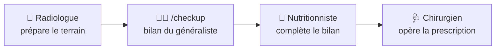

# 🏥 La Clinique du Code

> Prenez soin de votre code. Il prendra soin de votre santé mentale.

---

## 🧭 Pourquoi une clinique ?

La plupart des initiatives autour des agents de code (superpowers et compagnie) se
positionnent **pendant** le développement : planification, TDD, workflows de build,
délégation. La Clinique du Code, elle, se positionne **après** — en mécanisme
**post-traitement**.

Elle n'entre en scène qu'une fois le code produit, en **filet de sécurité** : un
agent looping qui revient sur ce qui a été écrit pour vérifier qu'il est **de
qualité** — pas avant de coder, pas pendant, mais après, pour rattraper ce qu'un
développement rapide laisse passer.

C'est aussi une philosophie **100 % manuelle** : la Clinique ne s'invite jamais dans
votre flux de travail.

- **Vous décidez quand** lancer une consultation — après une feature, un refactoring,
  ou quand votre code a l'air malade.
- **L'assistant peut suggérer**, jamais contraindre. Son rôle se limite à un rappel
  doux en fin d'itération.
- **Les praticiens diagnostiques ne modifient jamais le code** — ils sont en mode
  plan : ils diagnostiquent, prescrivent, et c'est vous qui décidez du traitement.
- **Le Chirurgien est le seul à opérer** — uniquement sur prescription validée
  (bilan d'un praticien + votre accord). Il n'opère que ce qui est prescrit, jamais
  plus.

Pas de CI intrusive, pas de hook qui juge, pas de robot qui pleure dans vos pull
requests. Juste une équipe de praticiens compétents, disponibles quand vous les appelez.

---

## 👨‍⚕️ La composition de la clinique

| Praticien | Agent | Mode | Rôle |
|---|---|---|---|
| 🧠 Thérapeute du Code | `therapist` | plan | Qualité du code, architecture, refactorabilité — détecte les vrais problèmes, diagnostique les causes racines, recommande avec trade-offs |
| 🔬 Diagnosticien des Tests | `diagnostician` | plan | Passe les tests unitaires au laboratoire : pertinence, robustesse, maintenabilité |
| 🩻 Radiologue de l'Architecture | `radiologist` | plan | Passe le dépôt aux rayons X de l'historique git : churn, couplage, zones de douleur |
| 🥗 Nutritionniste du Projet | `nutritionist` | plan | Vérifie que le code écrit est nécessaire : code mort, spéculation (YAGNI), sur-ingénierie, dosage |
| 🩺 Chirurgien | `surgeon` | build | Opère la prescription d'un praticien dans des sous-agents, lot par lot, avec vérification |

Les praticiens diagnostiques (mode **plan**) s'appuient chacun sur un skill
spécialisé (`code-therapist`, `test-diagnostician`, `zone-of-pain`, `nutritionist`).
Le Chirurgien (mode **build**) est le seul capable de modifier le code — uniquement
le code prescrit, jamais plus.

---

## 🧭 Le parcours de soins

Chaque expert reste consultable **seul**, à la demande — le parcours est une
suggestion, pas un protocole imposé. Et la règle d'or s'applique partout : on
diagnostique et on prescrit en mode plan, et on n'opère jamais sans prescription
validée.

---

## 📦 Installation

Voir [**docs/installation.md**](docs/installation.md) — prérequis, installation
Windows (PowerShell) et Linux/macOS (manuel), installation du système prompt, et
prompt d'installation from scratch par un agent de code.

## 🧭 Utilisation

Voir [**docs/usage.md**](docs/usage.md) — la commande `/checkup` (session, chemin,
branche), les consultations à la demande, et le passage au bloc avec le Chirurgien.

---

## 📝 Licence

[MIT](LICENSE) — la Clinique est ouverte à tous, les soins sont gratuits.
