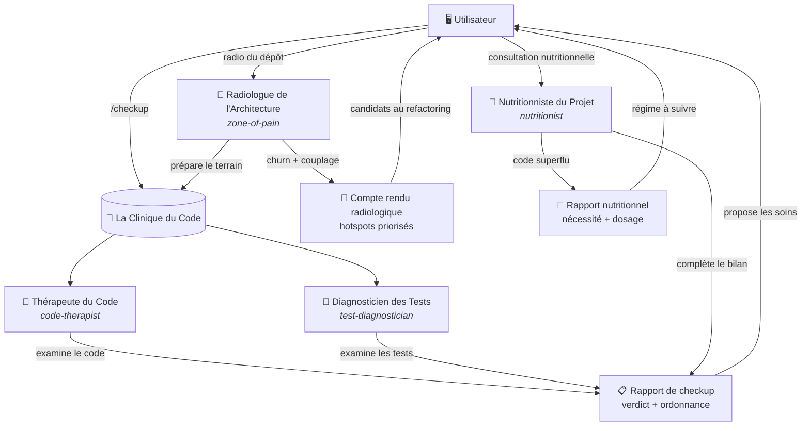

# 🏥 La Clinique du Code

> Prenez soin de votre code. Il prendra soin de votre santé mentale.


---

## Pourquoi une clinique ?

Votre code est vivant. Il naît, il évolue, il se dégrade. Comme un patient, il a besoin
de **suivi régulier**, pas seulement de soins d'urgence quand il est déjà en prod et que
ça saigne.

La Clinique du Code est un plugin pour [opencode](https://opencode.ai) qui met à votre
disposition une **équipe de praticiens** — des skills spécialisés — et une **commande de
checkup** pour les faire consulter sur votre code.

Chaque praticien est un expert. La clinique ne fait pas d'opérations à votre place :
elle **diagnostique**, elle **recommande**, et c'est vous qui décidez du traitement.



---

## 👨‍⚕️ Les praticiens

### 🧠 Le Thérapeute du Code — `code-therapist`

> « Racontez-moi ce que fait ce code. Comment vous sentez-vous dans cette méthode de 200 lignes ? »

Le Thérapeute du Code est votre coach senior en **qualité de code**. Il examine votre
patient (le code) comme un psychologue examine son patient : il écoute, il diagnostique,
il soigne.

| Compétences | Traitements |
|---|---|
| Revue de code experte | Refactoring incrémental |
| Analyse d'architecture | Décisions avec trade-offs explicites |
| Détection d'odeurs de code | Priorisation par sévérité (🔴🟠🟡🔵) |
| Évaluation de la lisibilité | Calibrage selon le contexte projet |

Sa philosophie : **contexte > règles, lisibilité > ingéniosité, simple > générique,
évolution > renaissance**. Il ne récite pas SOLID pour faire savant — il l'utilise pour
faire avancer votre code. Et il ne réécrit jamais : il refactore, toujours.

### 🔬 Le Diagnosticien des Tests — `test-diagnostician`

> « On m'a amené vos tests. Pas de panique, je suis équipé. »

Le Diagnosticien des Tests est votre **spécialiste de laboratoire**. Il analyse vos
tests unitaires pour vérifier qu'ils sont dignes de confiance avant la recette.

| Analyses | Verdicts |
|---|---|
| Propriétés fondamentales (rapide, indépendant, répétable...) | ✅ Adopté |
| Structure Given-When-Then | ⚠️ À revoir |
| Pertinence des assertions (« ne jamais faire confiance à un test qu'on n'a pas vu échouer ») | ❌ À refaire |
| Fragilité, couplage à l'implémentation, mutualisation des assets | |

### 🩻 Le Radiologue de l'Architecture — `zone-of-pain`

> « Votre dépôt aux rayons X, sans RDV. Je vous montre où ça fait mal. »

Le Radiologue de l'Architecture est votre **spécialiste de l'imagerie médicale du
dépôt**. Il passe le projet aux rayons X de l'historique git et des dépendances pour
révéler les zones de douleur : les fichiers qui saignent (fort churn), ceux qui
tiennent tout l'édifice entre leurs mains (fort couplage), et les couples de fichiers
qui bougent toujours ensemble (couplage temporel).

| Imagerie | Compte rendu |
|---|---|
| Churn git (fichiers les plus modifiés) | Top 5 des fichiers par score de douleur |
| Couplage d'imports entrants | Candidats au refactoring priorisés |
| Couplage temporel (commits groupés) | Fiabilité du résultat annoncée |
| Aucune dépendance — Node ≥ 14, zéro `npm install` | Rapport `zone-of-pain.md` généré à la racine |

La radio se prescrit à la demande — c'est lui qui désigne les patients prioritaires
du Thérapeute.

### 🥗 Le Nutritionniste du Projet — `nutritionist`

> « Vous mangez trop. Certaines portions, vous ne les mangez même pas. »

Le Nutritionniste du Projet est votre **spécialiste de la nécessité**. Il ne juge ni
l'optimisation, ni le nombre de lignes : il vérifie que tout le code écrit est
**nécessaire** et dimensionné aux usages réels.

| Analyses | Verdicts |
|---|---|
| Code mort (fichiers orphelins, exports sans référence, endpoints sans consommateurs) | ✅ Régime équilibré |
| Spéculation YAGNI (abstractions à 1 usage, généricité anticipée, feature flags inertes) | ⚠️ Régime à surveiller |
| Réinvention de roue (réimplémentation de l'existant) | ❌ Régime à revoir |
| Dosage (complexité écrite vs complexité réelle du domaine) | |

Il ne statue jamais sans connaître les usages : il questionne d'abord, diagnostique
ensuite. Et comme toute la clinique, il prescrit — il n'opère pas.

---

## 🩺 La commande `/checkup`

Une commande, deux praticiens, un rapport.

```bash
/checkup                      # tout le travail de la session courante
/checkup src/services         # un périmètre précis
/checkup branch:feature/xyz   # les diffs d'une branche vs la base
```

`/checkup` ouvre le dossier patient, puis :

1. **Le Thérapeute du Code** examine le code source du périmètre ;
2. **Le Diagnosticien des Tests** passe les tests au laboratoire ;
3. La clinique produit un **rapport de checkup** : constats par sévérité, verdict
   global (✅ sain / ⚠️ soins nécessaires / ❌ hospitalisation) et ordonnance priorisée.

> ⚠️ Règle d'or de la clinique : **aucune opération pendant un checkup**. Les
> praticiens diagnostiquent et prescrivent. L'opération (le refactoring) ne se fait
> qu'avec l'accord explicite du patient — l'utilisateur.

---

## 🧭 Le parcours de soins

Le généraliste et les experts ne travaillent pas en parallèle : ils s'organisent.

- **`/checkup` est le bilan du généraliste** — la consultation d'entrée, le premier
  réflexe. Le Thérapeute et le Diagnosticien examinent le code et les tests, et
  orientent vers les spécialistes quand ils le jugent utile.
- **🩻 Le Radiologue prépare le terrain** — avant ou pendant un checkup, sa radio
  désigne les fichiers qui saignent (churn + couplage). C'est lui qui dit au
  généraliste *où regarder*.
- **🥗 Le Nutritionniste complète le bilan** — quand le checkup montre du code sain
  mais suspect, il vérifie que ce code **devrait** exister (code mort, sur-ingénierie,
  dosage). Le Thérapeute lui transmet les constats de nécessité croisés au passage.

Un parcours typique :

```
🩻 radio (où ça fait mal ?) → 🧑‍⚕️ checkup (bilan généraliste) → 🥗 nutritionniste (ce code doit-il exister ?)
```

Chaque expert reste consultable **seul**, à la demande — le parcours est une
suggestion, pas un protocole imposé. Et la règle d'or s'applique partout : on
diagnostique, on prescrit, on n'opère jamais sans l'accord du patient.

---

## 📋 Installation — Prendre rendez-vous

### Prérequis

- [opencode](https://opencode.ai) installé et fonctionnel

### Étape 1 — Cloner la clinique

```bash
git clone https://github.com/alexandrerodenas/la-clinique-du-code.git
```

### Étape 2 — Installer les praticiens

**Windows (PowerShell) :**

```powershell
.\install.ps1
```

**Linux / macOS (manuel, le script équivalent arrive) :**

```bash
mkdir -p ~/.config/opencode/skills ~/.config/opencode/commands
for skill in skills/*/; do cp -r "$skill" ~/.config/opencode/skills/; done
cp commands/checkup.md ~/.config/opencode/commands/
```

L'installation copie les praticiens (skills) et la commande `/checkup` dans la
configuration globale d'opencode — ils seront disponibles dans tous vos projets.

### Étape 3 — Installer le système prompt de la clinique

Ajoutez le contenu de [`templates/AGENTS.md.clinic`](templates/AGENTS.md.clinic) dans
votre `AGENTS.md` (global ou par projet). C'est ce qui donne à votre assistant la
notion de checkup : savoir **proposer** une consultation après un développement —
jamais l'imposer.

### Étape 4 — Redémarrer opencode

La configuration est chargée au démarrage. Quittez et relancez opencode.

---

## 🤖 Installation par un agent de code (from scratch)

Pas envie de le faire à la main ? Copiez-collez le prompt suivant dans votre
assistant de code. Il installe la clinique tout seul, étape par étape :

```text
Tu vas installer « La Clinique du Code » (un plugin opencode : des praticiens
[skills] + la commande /checkup + un système prompt) depuis le dépôt
https://github.com/alexandrerodenas/la-clinique-du-code.git

Suis ces étapes exactement, dans l'ordre :

1. Clone le dépôt dans un dossier temporaire :
   git clone https://github.com/alexandrerodenas/la-clinique-du-code.git <tmp>

2. Détermine le dossier de configuration global d'opencode :
   - Windows : %USERPROFILE%\.config\opencode\
   - Linux / macOS : ~/.config/opencode/
   (appelons-le <config>)

3. Installe tous les praticiens (skills) :
   - pour chaque dossier <tmp>\skills\<nom>, copie-le récursivement vers
     <config>\skills\<nom> (code-therapist, test-diagnostician, zone-of-pain,
     et tous ceux qui apparaîtront à l'avenir)

4. Installe la commande /checkup :
   - copie <tmp>\commands\checkup.md vers <config>\commands\checkup.md

5. Installe le système prompt de la clinique :
   - lis le fichier <tmp>\templates\AGENTS.md.clinic
   - ajoute son contenu à la fin du fichier <config>\AGENTS.md
     (en retirant la première ligne d'en-tête « # Ce bloc est à ajouter dans le
     fichier AGENTS.md de votre projet. »)
   - si <config>\AGENTS.md n'existe pas, crée-le avec ce contenu

6. Nettoie le dossier temporaire <tmp>.

7. Vérifie que tous les praticiens et la commande sont en place, et que le bloc
   clinique est bien présent dans AGENTS.md. Annonce le résultat.

8. Préviens l'utilisateur : il doit quitter et redémarrer opencode pour que la
   Clinique prenne effet.

Si tu détectes d'anciens praticiens installés ailleurs (par exemple
~/.agents/skills/code-therapy, ~/.agents/skills/test-diagnostics ou
~/.agents/skills/zone-of-pain), demande à l'utilisateur s'il veut les supprimer
avant de terminer.
```

Ce prompt fonctionne sur n'importe quel assistant de code disposant d'un shell
(Windows, Linux ou macOS) : il ne présuppose ni script, ni outil spécifique.

---

## 🧭 Utilisation

```bash
/checkup                                # consultation sur le travail de la session
/checkup <chemin>                       # consultation sur un périmètre précis
/checkup branch:<branche>               # consultation sur les diffs d'une branche (vs la base)
```

Une radio du dépôt se prescrit à part, quand vous en avez besoin :

```bash
analyse la zone of pain de ce dépôt    # scan radiologique (churn + couplage)
```

Après un développement significatif, votre assistant peut vous **inviter** à lancer un
checkup :

> « Le développement est terminé. Souhaitez-vous que je lance un checkup de la
> Clinique du Code avant la recette ? »

À vous de décider. C'est le contrat.

---

## ⚖️ La philosophie : 100 % manuel

La Clinique du Code ne s'invite jamais dans votre flux de travail.

- **Vous décidez quand** lancer un checkup — après une feature, un refactoring, ou
  quand votre code a l'air malade.
- **L'assistant peut suggérer**, jamais contraindre. Son rôle se limite à un rappel
  doux en fin d'itération.
- **Les praticiens ne modifient jamais le code** — ils diagnostiquent, et vous opérez
  si vous le souhaitez.

Pas de CI intrusive, pas de hook qui juge, pas de robot qui pleure dans vos pull
requests. Juste une équipe de praticiens compétents, disponibles quand vous les appelez.

---

## 🚑 Recrutement — La clinique grandit

L'équipe actuelle compte trois praticiens, mais la clinique est ouverte. Les prochains
spécialistes potentiels :

| Poste | Spécialité |
|---|---|
| 🛡️ Le Garde-Fou de la Sécurité | analyse des vulnérabilités, secrets, injection |
| ⚡ Le Kiné des Performances | analyses N+1, complexité algorithmique, cache |
| ♿ Le Docteur de l'Accessibilité | WCAG, usages handicapés |

Un repo ouvert à la contribution : vous pouvez proposer un nouveau praticien en créant
un skill dans `skills/<nom>/SKILL.md` et sa fiche dans ce README.

---

## 📝 Licence

[MIT](LICENSE) — la Clinique est ouverte à tous, les soins sont gratuits.
