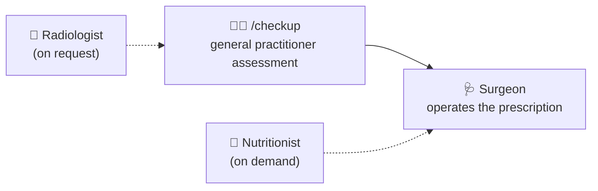

# 🏥 The Code Clinic

> Take care of your code. It will take care of your mental health.

---

## 🧭 Why a clinic?

Most initiatives around code agents (planning, TDD, build workflows, and delegation)
operate **during** development. The Code Clinic positions itself **afterward**,
as a **post-processing** mechanism.

It only comes into play once the code has been produced, as a **safety net**:
an agent loop that revisits the written code to verify its **quality**. It does
not intervene before or during coding; it catches what rapid development can miss.

It is also a **100% manual** philosophy: the Clinic never invites itself into
your workflow.

- **You decide when** to launch a consultation — after a feature, a refactoring
or when your code looks sick.
- **The assistant can suggest**, but never force, a consultation. Its role is
limited to a gentle reminder at the end of an iteration.
- **Diagnostic practitioners never modify the code** — they operate in
plan mode: they diagnose and prescribe, while you decide on the treatment.
- **The Surgeon is the only one to operate** — only on a validated prescription
(an assessment from a practitioner plus your agreement). The Surgeon operates
only on what is prescribed, never more.

There is no intrusive CI, judgmental hook, or robot crying in your pull
requests. There is only a team of knowledgeable practitioners, available when
you call them.

---

## 👨‍⚕️ The clinic team

| Practitioner | Agent | Mode | Role |
|---|---|---|---|
| 🧠 Code Therapist | `therapist` | plan | Code quality, architecture, refactorability — detects real problems, diagnoses root causes, recommends with trade-offs |
| 🔬 Test Diagnostician | `diagnostician` | plan | Reviews unit tests in the laboratory: relevance, robustness, maintainability |
| 🩻 Architectural Radiologist | `radiologist` | plan | Examines Git history and dependencies: churn, coupling, pain zones |
| 🥗 Project Nutritionist | `nutritionist` | plan | Verifies that written code is necessary: dead code, speculation (YAGNI), over-engineering, and poor sizing |
| 🩺 Surgeon | `surgeon` | build | Executes an approved prescription in sub-agents, batch by batch, with verification |

Each diagnostic practitioner in **plan** mode relies on a specialized skill
(`code-therapist`, `test-diagnostician`, `zone-of-pain`, or `nutritionist`).
The Surgeon in **build** mode is the only practitioner who can modify code, and
only within the approved prescription.

---

## 🧭 The care pathway

Each expert can be consulted **individually**, on demand. The Radiologist and
Nutritionist are not part of the `/checkup` protocol. The pathway is a
suggestion, not a mandatory procedure: plan-mode agents diagnose and prescribe,
and nothing is operated on without an approved prescription.

---

## 🧩 Architecture

The Clinic is organized in two layers:

- `core/` contains the principles, protocols and tools independent of a harness;
- `adapters/` contains the integrations specific to each code helper.

The OpenCode and GitHub Copilot adapters are provided in
`adapters/opencode/` and `adapters/copilot/`. They expose the same portable
protocols, including `/checkup` and `/intensive-care` (alias
`/soins-intensifs`), in their native formats.

## 📦 Installation

See [**docs/installation.md**](docs/installation.md) for installing the
OpenCode and GitHub Copilot adapters and using the portable core.

## 🧭 Usage

See [**docs/usage.md**](docs/usage.md) for `/checkup` and
`/intensive-care` (session, path, or branch), on-demand consultations, and
the handoff to the Surgeon.

---

## 📝 License

[MIT](LICENSE) — the Clinic is open to all, care is free.
